# HTML Grundlagen 1 – Dokumentaufbau & Grundgerüst

!!! abstract "Lernziele"
    Nach diesem Kapitel kannst du …

    - Ein **korrektes HTML-Grundgerüst** erstellen (inkl. `<!DOCTYPE html>`).
    - Tags **sauber verschachteln** (ohne „Überkreuz-Schließen“).
    - Den Aufbau eines HTML-Dokuments (**`html` → `head` + `body`**) erklären.
    - **Block- vs. Inline-Elemente** unterscheiden.

---

## Einführung
Wie funktioniert das Internet?
{{ youtube_video("https://www.youtube.com/embed/fZG_Odfe73g") }}

HTML ist wie das **Skelett** einer Webseite: Es beschreibt Struktur und Bedeutung (Semantik) – nicht das Design.

{ align=left width=300px }

{{ task(file="tasks/01_00_01.yaml") }}

---

## Aufbau von HTML-Dokumenten

Ein HTML-Dokument besteht (mindestens) aus:

```mermaid
flowchart TD
  A["&lt;!DOCTYPE html&gt;"] --> B["&lt;html&gt;"]
  B --> C["&lt;head&gt;"]
  B --> D["&lt;body&gt;"]
  C --> C1["&lt;meta charset=&quot;utf-8&quot;&gt;"]
  C --> C2["&lt;title&gt;…&lt;/title&gt;"]
  D --> D1["&lt;h1&gt;…&lt;/h1&gt;"]
  D --> D2["&lt;p&gt;…&lt;/p&gt;"]
```

- `<!DOCTYPE html>` (Dokumenttyp)
- `<html>` (Wurzel-Element)
  - `<head>` (Metadaten, Titel, Verweise auf CSS/JS, …)
  - `<body>` (sichtbarer Inhalt)



!!! info "Merke"
    Alles, was **im Browserfenster sichtbar** ist, gehört in den **`<body>`**.
    Alles, was die Seite **beschreibt/konfiguriert**, gehört in den **`<head>`**.

{{ youtube_video("https://www.youtube.com/embed/ItbLHoFt9ac") }}

---

## Schachtelung von Tags (Nested Tags)

Beim Verschachteln gilt:

- **Jedes öffnende Tag** braucht (meist) ein **passendes schließendes Tag**.
- Tags dürfen **nicht über Kreuz** geschlossen werden.

✅ korrekt:

```html
<p>Das ist <strong>wichtig</strong>!</p>
```

❌ falsch (über Kreuz):

```html
<p>Das ist <strong>wichtig</p></strong>
```


!!! warning "Typischer Anfängerfehler"
    Wenn du beim Lesen den Überblick verlierst: **Einrückungen** helfen extrem!
    In VS Code: markiere Code → **Shift + Alt + F** (Format Document).

{{ task(file="tasks/01_00_02.yaml") }}

{{ youtube_video("https://www.youtube.com/embed/X7YArEDXSdE") }}

---

## Grundgerüst einer HTML-Seite + DOCTYPE

### DOCTYPE-Definition

`<!DOCTYPE html>` sagt dem Browser: „Das ist **HTML5**“.
Ohne DOCTYPE können Browser in einen **Quirks Mode** fallen (seltsame Layout-Bugs).

!!! tip "VS Code Turbo (Emmet)"
    Leere HTML-Datei

    → tippe ++exclamation++

    → drücke ++tab++ (oder ++enter++)

    → VS Code erzeugt automatisch das Grundgerüst.

### Minimal-Gerüst (Empfehlung)

```html
<!DOCTYPE html>
<html lang="de">
  <head>
    <meta charset="utf-8" />
    <meta name="viewport" content="width=device-width, initial-scale=1" />
    <title>Meine erste Seite</title>
  </head>
  <body>
    <h1>Hallo HTML!</h1>
    <p>Ich bin bereit.</p>
  </body>
</html>
```

!!! note "Warum `lang`?"
    `lang="de"` hilft Screenreadern, Übersetzern, Suchmaschinen und Browsern (z. B. Silbentrennung).

{{ task(file="tasks/01_00_03.yaml") }}

{{ youtube_video("https://www.youtube.com/embed/TvdUR1hiKXI") }}

---

## Block- und Inline-Elemente

### Block vs. Inline (Grundidee)

- **Block-Elemente** beginnen typischerweise in einer **neuen Zeile** und nehmen „Breite“ ein (z. B. `div`, `p`, `h1`).
- **Inline-Elemente** fließen **im Text** mit (z. B. `span`, `a`, `strong`, `em`).

| Kategorie | Beispiele | Typisches Verhalten |
|---|---|---|
| Block | `div`, `p`, `h1`–`h6`, `ul`, `li` | Neue Zeile, „Kasten“ |
| Inline | `span`, `a`, `strong`, `em`, `img` | Im Textfluss |

!!! info "Wichtig"
    Das ist das **Standardverhalten**. Mit CSS (`display`) kann man es ändern – aber erst verstehen, dann verbiegen. 🙂

{{ youtube_video("https://www.youtube.com/embed/jP4r7bpJEGw") }}

{{ task(file="tasks/01_00_04.yaml") }}

---

## Attribute (die wichtigsten am Anfang)

Attribute stehen im **öffnenden Tag**:

```html
<a href="https://example.com" target="_blank" title="Beispielseite">Link</a>
```

| Attribut | Wo? | Zweck | Beispiel |
|---|---|---|---|
| `id` | fast überall | eindeutige Kennung (1× pro Seite) | `id="header"` |
| `class` | fast überall | Gruppe/Kategorie (CSS/JS) | `class="card primary"` |
| `href` | `a` | Link-Ziel | `href="seite2.html"` |
| `src` | `img`, `script` | Quelle einer Datei | `src="img/logo.png"` |
| `alt` | `img` | Alternativtext (Barrierefreiheit!) | `alt="Firmenlogo"` |
| `lang` | `html` | Sprache des Dokuments | `lang="de"` |
| `charset` | `meta` | Zeichencodierung | `utf-8` |

!!! danger "Alt-Text ist kein Deko-Text"
    `alt` beschreibt **den Informationsgehalt** des Bildes.
    Deko? Dann oft `alt=""` (leer), damit Screenreader es überspringen.

{{ task(file="tasks/01_00_05.yaml") }}
