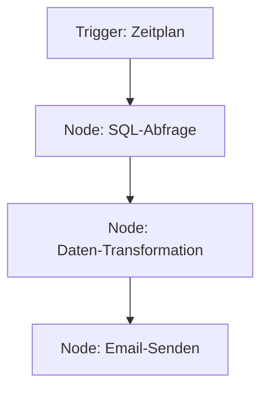

# Low_Code 1 – Plattformen, Konnektoren & Logik

!!! abstract "Lernziele"
    Nach diesem Kapitel kannst du …

    - die **Prinzipien** von Low‑Code-Plattformen beschreiben.
    - **Konnektoren** zu Datenbanken und APIs konfigurieren.
    - einfache **Flussdiagramme** (Mermaid) zur Prozesssteuerung nutzen.
    - eigene **Workflows** mit Drag‑and‑Drop bauen.
    - Fehlerbehandlung in Low‑Code‑Apps implementieren.

---

## Einführung

Low‑Code‑Plattformen erlauben die Entwicklung von Anwendungen ohne umfangreiches Programmieren. Du arbeitest mit visuellen Modulen, Datenflussdiagrammen und vorkonfigurierten Konnektoren, um schnell funktionale Prototypen zu erstellen.

{{ task(file="tasks/01_00_01.yaml") }}

---

## Grundbegriffe

| Begriff | Definition |
|---|---|
| **Node** | Ein Baustein im Workflow (z. B. Datenabfrage, Transformation, Aktion). |
| **Connector** | Schnittstelle zu externen Systemen (Datenbanken, REST‑APIs, Cloud‑Services). |
| **Flow** | Reihenfolge der Nodes, definiert die Logik. |
| **Trigger** | Ereignis, das einen Flow startet (z. B. Zeitplan, API‑Call). |

---

## Beispiel: Datenbank‑abfrage

*Connector‑Konfiguration:* Gib Datenbank‑URL, Benutzername und Passwort an. Verwende das integrierte SQL‑Editor‑Tool, um die Abfrage zu schreiben.

---

## Drag‑and‑Drop Workflow

1. **Drag** den gewünschten Node auf die Arbeitsfläche.
2. **Doppelklick** öffnen das Konfigurationsfenster.
3. **Speichern** und **Aktivieren** des Flows.

---

## Fehlerbehandlung

Viele Plattformen bieten **Error‑Handling Nodes**:

- **Retry**: Wiederhole die Aktion bei Fehler.
- **Alert**: Sende eine Benachrichtigung.
- **Skip**: Fahre fort, ohne den Flow abzubrechen.

---

## Aufgaben & Übungen

Die Aufgaben konzentrieren sich auf die Konfiguration von Connectors, das Erstellen von Flows und das Testen von Fehlerfällen.

{{ task(file="tasks/01_00_02.yaml") }}

{{ youtube_video("https://www.youtube.com/embed/ItbLHoFt9ac") }}

---

## Zusammenfassung

Low‑Code‑Plattformen ermöglichen die schnelle Entwicklung von Anwendungen durch visuelle Logik und vorgefertigte Konnektoren. Nutze die Übungen, um die wichtigsten Funktionen und Fehlerbehandlungsmechanismen zu meistern.
