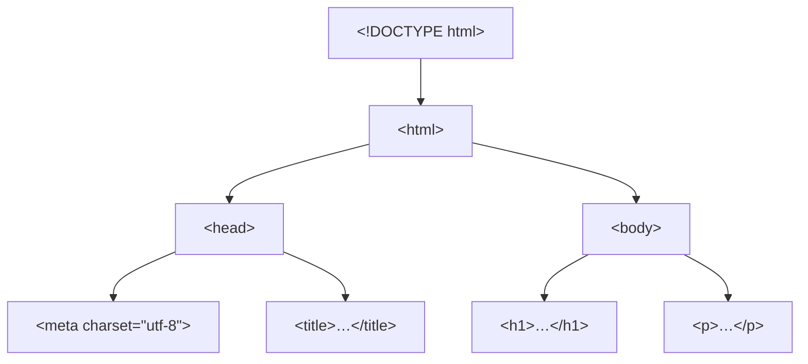
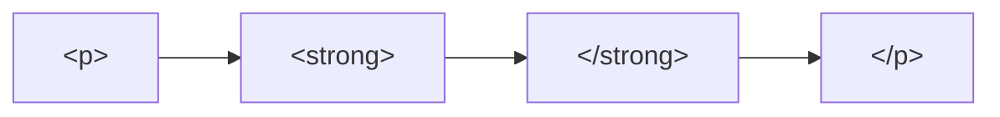

# HTML Grundlagen 1 – Dokumentaufbau, Tag-Schachtelung & Grundgerüst

!!! abstract "Lernziele"
    Nach diesem Kapitel kannst du …

    - ein **korrektes HTML-Grundgerüst** erstellen (inkl. `<!DOCTYPE html>`).
    - Tags **sauber verschachteln** (ohne „Überkreuz-Schließen“).
    - den Aufbau eines HTML-Dokuments (**`html` → `head` + `body`**) erklären.
    - **Block- vs. Inline-Elemente** unterscheiden.
    - gängige **Attribute** (z. B. `lang`, `charset`, `href`, `src`, `alt`, `class`, `id`) sinnvoll einsetzen.
    - **wichtige HTML-Elemente** erkennen und verwenden.
    - **HTML-Kommentare** und **selbstschließende Tags** anwenden.

---

## Einführung

HTML ist wie das **Skelett** einer Webseite: Es beschreibt Struktur und Bedeutung (Semantik) – nicht das Design.
{ align=left width=300px }

{{ task(file="tasks/01_00_01.yaml") }}

---

## Wichtige HTML-Elemente

Bevor wir tiefer gehen, hier die wichtigsten Elemente für den Anfang:

### Container-Elemente
- **`<div>`** - Block-Element für Gruppierung und Layout
- **`<span>`** - Inline-Element für Text-Auszeichnung

### Medien-Elemente
- **``** - Bild (selbstschließend)
- **`<a href="seite.html">Linktext</a>`** - Verknüpfung

### Listen-Elemente
- **`<ul>`** - Ungeordnete Liste (Bullet Points)
- **`<ol>`** - Geordnete Liste (Nummern)
- **`<li>`** - Listenelement (nur innerhalb von ul/ol block)

### Trenn-Elemente
- **`<br>`** - Zeilenumbruch (selbstschließend)
- **`<hr>`** - Horizontale Linie (selbstschließend)

!!! info "Tipp"
    Diese Elemente sind die Bausteine für fast jede HTML-Seite. Wir werden sie im Laufe des Kurses genauer kennenlernen.

---

## Aufbau von HTML-Dokumenten

Ein HTML-Dokument besteht (mindestens) aus:

- `<!DOCTYPE html>` (Dokumenttyp)
- `<html>` (Wurzel-Element)
  - `<head>` (Metadaten, Titel, Verweise auf CSS/JS, …)
  - `<body>` (sichtbarer Inhalt)



!!! info "Merke"
    Alles, was **im Browserfenster sichtbar** ist, gehört in den **`<body>`**.  
    Alles, was die Seite **beschreibt/konfiguriert**, gehört in den **`<head>`**.

{{ youtube_video("https://www.youtube.com/embed/ItbLHoFt9ac") }}

---

## 3 Schachtelung von Tags (Nested Tags)

Beim Verschachteln gilt:

- **Jedes öffnende Tag** braucht (meist) ein **passendes schließendes Tag**.
- Tags dürfen **nicht über Kreuz** geschlossen werden.

✅ korrekt:

```html
<p>Das ist <strong>wichtig</strong>!</p>
```

❌ falsch (über Kreuz):

```html
<p>Das ist <strong>wichtig</p></strong>
```



!!! warning "Typischer Anfängerfehler"
    Wenn du beim Lesen den Überblick verlierst: **Einrückungen** helfen extrem!  
    In VS Code: markiere Code → **Shift + Alt + F** (Format Document).

{{ task(file="tasks/01_00_02.yaml") }}

{{ youtube_video("https://www.youtube.com/embed/X7YArEDXSdE") }}

---

## HTML-Kommentare

Kommentare werden im Browser nicht angezeigt, sind aber für Entwickler wichtig:

```html
<!-- Dies ist ein Kommentar -->
<h1>Überschrift</h1>
<!-- TODO: Bild hinzufügen -->
<p>Text</p>
<!--
  Mehrzeiliger Kommentar
  Nützlich für größere Notizen
-->
```

**Wann verwendet man Kommentare?**
- Code-Auskommentierung während der Entwicklung
- Notizen für andere Entwickler (oder dein zukünftiges Ich)
- Temporäres Entfernen von Code
- Dokumentation von komplexen Logiken

---

## Grundgerüst einer HTML-Seite + DOCTYPE

### DOCTYPE-Definition

`<!DOCTYPE html>` sagt dem Browser: „Das ist **HTML5**“.  
Ohne DOCTYPE können Browser in einen **Quirks Mode** fallen (seltsame Layout-Bugs).

!!! tip "VS Code Turbo (Emmet)"
    Leere HTML-Datei 
    
    → tippe ++exclamation++ 
    
    → drücke ++tab++ (oder ++enter++)  

    → VS Code erzeugt automatisch das Grundgerüst.

### Minimal-Gerüst (Empfehlung)

```html
<!DOCTYPE html>
<html lang="de">
  <head>
    <meta charset="utf-8" />
    <meta name="viewport" content="width=device-width, initial-scale=1" />
    <title>Meine erste Seite</title>
  </head>
  <body>
    <h1>Hallo HTML!</h1>
    <p>Ich bin bereit.</p>
  </body>
</html>
```

!!! note "Warum `lang`?"
    `lang="de"` hilft Screenreadern, Übersetzern, Suchmaschinen und Browsern (z. B. Silbentrennung).

{{ task(file="tasks/01_00_03.yaml") }}

{{ youtube_video("https://www.youtube.com/embed/TvdUR1hiKXI") }}

---

### Selbstschließende Tags (Void Elements)

Einige HTML-Tags benötigen kein schließendes Tag:

```html

<br>
<hr>
<input type="text">
<meta charset="utf-8">
```

**Wichtige selbstschließende Tags:**
- `` - Bild
- `<br>` - Zeilenumbruch
- `<hr>` - Horizontale Linie
- `<input>` - Eingabefeld
- `<meta>` - Metadaten
- `<link>` - Verknüpfung zu externen Ressourcen

!!! info "Hinweis"
    In XHTML mussten selbstschließende Tags mit `/>` geschrieben werden (z. B. `<br />`). In HTML5 ist das optional, aber viele Entwickler schreiben es trotzdem für Konsistenz.

---

## Block- und Inline-Elemente + Attribute

### Block vs. Inline (Grundidee)

- **Block-Elemente** beginnen typischerweise in einer **neuen Zeile** und nehmen „Breite“ ein (z. B. `div`, `p`, `h1`).
- **Inline-Elemente** fließen **im Text** mit (z. B. `span`, `a`, `strong`, `em`).

| Kategorie | Beispiele | Typisches Verhalten |
|---|---|---|
| Block | `div`, `p`, `h1`–`h6`, `ul`, `li` | Neue Zeile, „Kasten“ |
| Inline | `span`, `a`, `strong`, `em`, `img` | Im Textfluss |

!!! info "Wichtig"
    Das ist das **Standardverhalten**. Mit CSS (`display`) kann man es ändern – aber erst verstehen, dann verbiegen. 🙂

{{ youtube_video("https://www.youtube.com/embed/jP4r7bpJEGw") }}

{{ task(file="tasks/01_00_04.yaml") }}

---

### Attribute (die wichtigsten am Anfang)

Attribute stehen im **öffnenden Tag**:

```html
<a href="https://example.com" target="_blank" title="Beispielseite">Link</a>
```

| Attribut | Wo? | Zweck | Beispiel |
|---|---|---|---|
| `id` | fast überall | eindeutige Kennung (1× pro Seite) | `id="header"` |
| `class` | fast überall | Gruppe/Kategorie (CSS/JS) | `class="card primary"` |
| `href` | `a` | Link-Ziel | `href="seite2.html"` |
| `src` | `img`, `script` | Quelle einer Datei | `src="img/logo.png"` |
| `alt` | `img` | Alternativtext (Barrierefreiheit!) | `alt="Firmenlogo"` |
| `lang` | `html` | Sprache des Dokuments | `lang="de"` |
| `charset` | `meta` | Zeichencodierung | `utf-8` |

!!! danger "Alt-Text ist kein Deko-Text"
    `alt` beschreibt **den Informationsgehalt** des Bildes.  
    Deko? Dann oft `alt=""` (leer), damit Screenreader es überspringen.

{{ task(file="tasks/01_00_05.yaml") }}

---

## HTML-Entities

Für Sonderzeichen, die nicht direkt eingegeben werden können:

| Entity | Zeichen | Verwendung |
|--------|---------|------------|
| `&nbsp;` | Nicht-umbrechbares Leerzeichen | `10&nbsp;kg` |
| `&lt;` | Kleiner als | `x < 5` |
| `&gt;` | Größer als | `x > 5` |
| `&amp;` | Und-Zeichen | `M & M` |
| `&quot;` | Anführungszeichen | `"Zitat"` |
| `&copy;` | Copyright-Zeichen | `© 2026` |

**Beispiel:**
```html
<p>Preis: 10&nbsp;€ pro Stück</p>
<p>5 &lt; 10 &gt; 3</p>
<p>M &amp; M's</p>
```

---

## Komplettes Beispiel

Hier ist ein vollständiges HTML-Dokument, das alle Konzepte kombiniert:

```html
<!DOCTYPE html>
<html lang="de">
<head>
    <meta charset="utf-8">
    <meta name="viewport" content="width=device-width, initial-scale=1">
    <meta name="description" content="Meine persönliche Webseite">
    <title>Meine erste Webseite</title>
    <link rel="stylesheet" href="style.css">
</head>
<body>
    <header>
        <h1>Willkommen auf meiner Webseite</h1>
        <nav>
            <ul>
                <li><a href="#ueber">Über mich</a></li>
                <li><a href="#kontakt">Kontakt</a></li>
            </ul>
        </nav>
    </header>

    <main>
        <section id="ueber">
            <h2>Über mich</h2>
            <p>Hier erzähle ich etwas über mich.</p>
            
        </section>

        <section id="kontakt">
            <h2>Kontakt</h2>
            <p>Du kannst mich erreichen unter: <a href="mailto:beispiel@example.com">beispiel@example.com</a></p>
        </section>
    </main>

    <footer>
        <p>&copy; 2026 - Meine Webseite</p>
    </footer>
</body>
</html>
```

---

## HTML-Validierung

Validiere deine HTML-Dateien mit dem **W3C Validator**:

1. Gehe zu [validator.w3.org](https://validator.w3.org)
2. Wähle "Datei hochladen" oder gib die URL ein
3. Klicke auf "Prüfen"

**Warum validieren?**
- Findet Fehler im Code
- Stellt sicher, dass Browser die Seite korrekt darstellen
- Verbessert die Barrierefreiheit
- Hilft bei der Fehlersuche

---

## Browser Developer Tools

So untersuchst du HTML im Browser:

1. **Öffnen:** Rechtsklick → "Untersuchen" (F12)
2. **Elements-Tab:** Zeigt HTML-Struktur
3. **Bearbeiten:** Klicke auf Element → ändere Attribut
4. **Live-Vorschau:** Änderungen sofort sichtbar

**Nützliche Funktionen:**
- HTML-Struktur anzeigen
- CSS-Regeln anzeigen
- JavaScript-Konsolen-Logs
- Netzwerk-Anfragen prüfen

---

## Semantische HTML5-Elemente

Verwende semantische Elemente für bessere Struktur:

```html
<header>      <!-- Kopfbereich -->
<nav>         <!-- Navigation -->
<main>        <!-- Hauptinhalt -->
<article>     <!-- Unabhängiger Inhalt -->
<section>     <!-- Inhaltliche Sektion -->
<aside>       <!-- Nebeninhalt -->
<footer>      <!-- Fußbereich -->
```

**Vorteile:**
- Bessere Barrierefreiheit (Screenreader)
- Besseres SEO (Suchmaschinen)
- Klarere Struktur für Entwickler
- Einfacheres Styling mit CSS

---

## Barrierefreiheit (Accessibility)

Wichtige Prinzipien:

### Alt-Texte für Bilder
```html

<!-- Gut: Beschreibt den Inhalt -->


<!-- Gut: Leerer Alt-Text für dekorative Bilder -->
```

### Semantische Struktur
- Verwende `<h1>` bis `<h6>` hierarchisch
- Nutze semantische Elemente (`<nav>`, `<main>`, etc.)

### Tastaturnavigation
- Alle interaktiven Elemente sollten per Tab erreichbar sein
- Vermeide `tabindex` außer bei Bedarf

### ARIA-Attribute (fortgeschritten)
```html
<button aria-label="Schließen">X</button>
<nav aria-label="Hauptnavigation">...</nav>
```

---

## SEO-Grundlagen (Suchmaschinenoptimierung)

Wichtige Meta-Tags für SEO:

```html
<!-- Beschreibung (wird in Suchergebnissen angezeigt) -->
<meta name="description" content="Kurze Beschreibung der Seite">

<!-- Keywords (weniger wichtig heute, aber immer noch relevant) -->
<meta name="keywords" content="HTML, CSS, Webentwicklung">

<!-- Autor -->
<meta name="author" content="Dein Name">

<!-- Robots (Steuerung der Indexierung) -->
<meta name="robots" content="index, follow">
```

**Weitere SEO-Tipps:**
- Eindeutige `<title>`-Tags pro Seite
- Strukturierte Überschriften (`<h1>` bis `<h6>`)
- Semantische HTML-Elemente
- Schnelle Ladezeiten
- Mobile-Friendly Design

---

## Nächste Schritte

Nachdem du diese Grundlagen beherrschst:

1. **CSS lernen** - Styling und Layout
2. **JavaScript Grundlagen** - Interaktivität
3. **Responsive Design** - Mobile-Friendly Webseiten
4. **Formulare** - `<form>`, `<input>`, `<label>`
5. **Tabellen** - `<table>`, `<thead>`, `<tbody>`
6. **Medien** - `<video>`, `<audio>`, `<iframe>`

**Empfohlene Ressourcen:**
- [MDN Web Docs](https://developer.mozilla.org/de/docs/Web/HTML)
- [W3Schools HTML Tutorial](https://www.w3schools.com/html/)
- [freeCodeCamp](https://www.freecodecamp.org/learn/2022/responsive-web-design/)

---

## Zusammenfassung & Checkliste

### Wichtige Konzepte
- ✅ HTML-Struktur: `<!DOCTYPE html>` → `<html>` → `<head>` + `<body>`
- ✅ Tag-Verschachtelung: Keine "Überkreuz"-Schließungen
- ✅ Attribute: `id`, `class`, `href`, `src`, `alt`, `lang`, `charset`
- ✅ Block vs. Inline: Unterschiedliches Verhalten
- ✅ Semantik: Bedeutung über Design

### Checkliste für jede HTML-Seite
- [ ] `<!DOCTYPE html>` am Anfang
- [ ] `<html lang="de">` mit Sprachattribut
- [ ] `<meta charset="utf-8">` im `<head>`
- [ ] `<meta name="viewport">` für Responsive Design
- [ ] Eindeutiger `<title>`-Tag
- [ ] Strukturierte Überschriften (`<h1>` bis `<h6>`)
- [ ] Semantische Elemente verwendet
- [ ] Bilder mit `alt`-Attributen
- [ ] Links mit beschreibendem Text
- [ ] Valide HTML (W3C Validator)
- [ ] Barrierefreiheit geprüft
- [ ] In Browser getestet

---

## Dateiorganisation

Empfohlene Struktur für kleine Projekte:

```
meine-webseite/
├── index.html          # Hauptseite
├── about.html          # Über mich
├── contact.html        # Kontakt
├── style.css           # CSS-Datei
├── script.js           # JavaScript-Datei
├── images/             # Bilder-Ordner
│   ├── logo.png
│   └── profil.jpg
└── docs/               # Dokumentation (optional)
    └── README.md
```

**Tipps:**
- Benenne Dateien sinnvoll (keine Umlaute, keine Leerzeichen)
- Verwende Kleinbuchstaben
- Trenne HTML, CSS, JavaScript
- Bilder in eigenem Ordner

---

## Version Control mit Git

Für HTML-Projekte empfohlen:

### .gitignore erstellen
```
# Ignorierte Dateien
*.log
.DS_Store
.vscode/
node_modules/
```

### Nützliche Git-Befehle
```bash
git init                          # Repository initialisieren
git add index.html                # Datei hinzufügen
git commit -m "Erste HTML-Seite"  # Commit erstellen
git status                        # Status anzeigen
git log                           # Commit-History
```

### GitHub Pages
HTML-Seiten können direkt auf GitHub Pages gehostet werden:
1. Repository auf GitHub erstellen
2. `index.html` pushen
3. In Repository-Settings "Pages" aktivieren

---

## Testing & Browser-Kompatibilität

### Cross-Browser Testing
Teste deine Seite in verschiedenen Browsern:
- **Chrome** (Desktop & Mobile)
- **Firefox**
- **Safari** (iOS & macOS)
- **Edge**

### Mobile Testing
- Verwende Browser-DevTools (Responsive Modus)
- Teste auf echten Geräten
- Prüfe Touch-Interaktionen

### Performance-Testing
- **Lighthouse** (in Chrome DevTools)
- **PageSpeed Insights** (online)
- **WebPageTest** (detaillierte Analyse)

### Accessibility-Testing
- **WAVE** (Web Accessibility Evaluation Tool)
- **axe DevTools** (Browser-Erweiterung)
- **Screenreader** (NVDA, JAWS, VoiceOver)

---

## HTML-Performance

### Schnelle Ladezeiten
- **Bilder optimieren**: Komprimieren, richtiges Format (WebP)
- **Lazy Loading**: `loading="lazy"` für Bilder unterhalb des Foldern
- **Minimieren**: HTML ohne unnötige Leerzeichen
- **Caching**: Browser-Caching nutzen

### Beispiel: Lazy Loading
```html

```

### Beispiel: Preloading
```html
<link rel="preload" href="wichtiges-bild.jpg" as="image">
```

### Tools für Performance
- **Lighthouse** (Chrome DevTools)
- **PageSpeed Insights** (Google)
- **GTmetrix** (detaillierte Analyse)

---

## HTML-Sicherheit

### XSS-Prävention (Cross-Site Scripting)
**Niemals** unverarbeiteten Benutzereintrag direkt in HTML ausgeben:

```html
<!-- Gefährlich: -->
<div>{{user_input}}</div>

<!-- Sicher: -->
<div>{{user_input|escape}}</div>
```

### Content Security Policy (CSP)
```html
<meta http-equiv="Content-Security-Policy"
      content="default-src 'self'; script-src 'self' https://trusted.cdn.com">
```

### HTTPS
- Verwende immer HTTPS für Produktion
- Viele moderne Features (Geolocation, Service Workers) benötigen HTTPS

### Formular-Sicherheit
```html
<form action="/submit" method="POST">
    <!-- CSRF-Token hinzufügen -->
    <input type="hidden" name="csrf_token" value="...">
</form>
```

---

## Interaktive Beispiele

### Beispiel 1: Klickbares Menü
```html
<nav>
    <button onclick="toggleMenu()">Menü</button>
    <ul id="menu" style="display:none">
        <li><a href="#home">Home</a></li>
        <li><a href="#about">About</a></li>
    </ul>
</nav>

<script>
function toggleMenu() {
    const menu = document.getElementById('menu');
    menu.style.display = menu.style.display === 'none' ? 'block' : 'none';
}
</script>
```

### Beispiel 2: Formular mit Validierung
```html
<form onsubmit="return validateForm()">
    <label for="email">Email:</label>
    <input type="email" id="email" required>
    <button type="submit">Senden</button>
</form>

<script>
function validateForm() {
    const email = document.getElementById('email');
    if (!email.value.includes('@')) {
        alert('Bitte gültige Email eingeben');
        return false;
    }
    return true;
}
</script>
```

---

## Projekt-Ideen zum Üben

### Beginner
1. **Persönliche Visitenkarte** - Name, Kontakt, Kurzinfo
2. **Rezept-Seite** - Zutaten, Anleitung, Bilder
3. **Produkt-Übersicht** - Produkte mit Beschreibung

### Intermediate
4. **Portfolio** - Projekte, Skills, Kontaktformular
5. **Blog** - Artikel, Kategorien, Suchfunktion
6. **Event-Seite** - Programm, Anmeldung, Karte

### Advanced
7. **E-Shop** - Produktkatalog, Warenkorb, Checkout
8. **Dashboard** - Statistiken, Charts, Tabellen
9. **Web-App** - Interaktive Anwendung mit JavaScript
