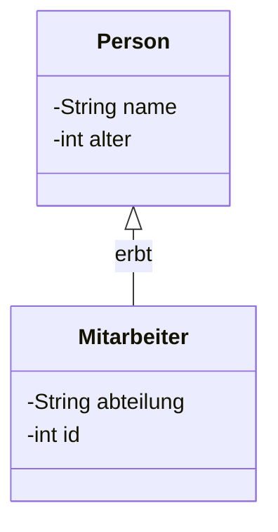

# Einführung in die objektorientierte Programmierung

!!! abstract "Lernziele"
    Nach diesem Kapitel kannst du …

    - **Objektorientierung** verstehen und anwenden.
    - **Klassen und Objekte** erstellen und verwenden.
    - **Attribute und Methoden** definieren.
    - **Instanzen** von Klassen erzeugen.
    - **Sichtbarkeit** von Elementen verstehen (`public`, `private`).

---

## Einführung

### Was ist objektorientierte Programmierung?

Objektorientierte Programmierung (OOP) ist ein **Programmierparadigma**, das auf der Idee von **Objekten** basiert. Ein Objekt ist eine **Instanz einer Klasse**, die Zustand (Daten) und Verhalten (Methoden) kapselt.

**Kernkonzepte der OOP:**
- **Klassen** - Blaupause oder Bauplan für Objekte
- **Objekte** - Konkrete Instanzen einer Klasse
- **Attribute** - Daten/Felder eines Objekts
- **Methoden** - Verhalten/Operationen eines Objekts
- **Vererbung** - Neues Objekt von existierendem ableiten
- **Polymorphismus** - Verschiedene Formen eines Objekts
- **Kapselung** - Daten und Methoden in einer Einheit

### Vergleich: Prozedural vs. OOP

**Prozedurale Programmierung:**
```java
// Daten und Verhalten sind getrennt
int alter = 25;
String name = "Max";
int berechneAlter(int geburtsjahr) {
    return 2024 - geburtsjahr;
}
```

**Objektorientierte Programmierung:**
```java
// Daten und Verhalten sind zusammengefasst
class Person {
    String name;
    int geburtsjahr;
    int berechneAlter() {
        return 2024 - this.geburtsjahr;
    }
}
```

---

## Klassen

### Was ist eine Klasse?

Eine **Klasse** ist ein **Bauplan** oder eine **Vorlage** für Objekte. Sie definiert:

- **Attribute** (Felder/Eigenschaften)
- **Methoden** (Verhalten/Funktionen)

### Klassendefinition

```java
class Auto {
    // Attribute
    String marke;
    String farbe;
    int baujahr;

    // Methode
    void faeren() {
        System.out.println("Das Auto fährt.");
    }
}
```

**Merke:**
- Klassen werden **großgeschrieben** (PascalCase)
- Eine Klasse hat keine Daten selbst, sondern definiert nur die **Struktur**
- Erst wenn eine Klasse instanziiert wird, gibt es ein **Objekt**

---

## Objekte

### Was ist ein Objekt?

Ein **Objekt** ist eine **Instanz** einer Klasse. Es ist ein **konkretes Exemplar** mit realen Werten.

### Objekt erstellen (Instanziierung)

```java
Auto meinAuto = new Auto();
```

**Aufbau:**
1. `new Auto()` - Erstellt ein neues Objekt (Instanz)
2. `meinAuto` - Variable, die das Objekt speichert
3. `.` - Punkt-Operator für Zugriff auf Member

### Objekt verwenden

```java
class Auto {
    String marke;
    String farbe;
    int baujahr;

    void faeren() {
        System.out.println("Das Auto fährt.");
    }
}

public class Main {
    public static void main(String[] args) {
        // Objekt erstellen
        Auto meinAuto = new Auto();

        // Attribute setzen
        meinAuto.marke = "VW";
        meinAuto.farbe = "Blau";
        meinAuto.baujahr = 2020;

        // Methode aufrufen
        meinAuto.faeren();

        // Informationen ausgeben
        System.out.println("Marke: " + meinAuto.marke);
        System.out.println("Farbe: " + meinAuto.farbe);
    }
}
```

**Ausgabe:**
```
Das Auto fährt.
Marke: VW
Farbe: Blau
```

---

## Methoden

### Methodendefinition

Eine Methode ist eine Funktion, die **zu einer Klasse** gehört:

```java
class Rechner {
    int addiere(int a, int b) {
        return a + b;
    }

    void druckeGreeting(String name) {
        System.out.println("Hallo " + name + "!");
    }
}
```

### Methodenparameter

Methoden können **Parameter** akzeptieren:

```java
class Rechner {
    // Methode mit einem Parameter
    int verdopple(int zahl) {
        return zahl * 2;
    }

    // Methode mit zwei Parametern
    int multipliziere(int a, int b) {
        return a * b;
    }

    // Methode ohne Parameter
    void begruessen() {
        System.out.println("Willkommen!");
    }
}
```

### Methodenrückgabewert

Methoden können **Werte zurückgeben** oder **nichts** (`void`):

```java
class Rechner {
    // Rückgabetyp ist int
    int addiere(int a, int b) {
        return a + b;  // Wert zurückgeben
    }

    // Rückgabetyp ist void (kein Wert)
    void druckeWert(int wert) {
        System.out.println("Wert: " + wert);
    }
}

public class Main {
    public static void main(String[] args) {
        Rechner rechner = new Rechner();

        int ergebnis = rechner.addiere(5, 3);  // Rückgabewert speichern
        rechner.druckeWert(ergebnis);         // void-Methode aufrufen

        System.out.println("Ergebnis: " + ergebnis);
    }
}
```

---

## `this` - Der aktuelle Objekt-Bezug

### Warum `this`?

`this` bezieht sich auf das **aktuelle Objekt** in einer Klasse.

```java
class Person {
    String name;

    void setzeName(String name) {
        // `this.name` ist das Attribut
        // `name` ist der Parameter
        this.name = name;
    }
}
```

### `this` im Vergleich

```java
class Person {
    String name;  // Attribut

    // Konstruktor
    Person(String name) {
        this.name = name;  // this.name ist das Attribut
    }

    // Methode
    void druckeName() {
        System.out.println("Name: " + this.name);  // this.name ist das Attribut
    }
}
```

**Merke:**
- Wenn Parameter und Attribut denselben Namen haben, verwendet man `this`, um das Attribut zu bezeichnen
- `this` ist optional, wenn Namen unterschiedlich sind

---

## Mermaid-Diagramm: Klassen-Struktur



---

## Zusammenfassung & Checkliste

### Wichtige Konzepte
- ✅ **OOP** ist ein Programmierparadigma basierend auf Objekten
- ✅ **Klassen** sind Baupläne für Objekte
- ✅ **Objekte** sind Instanzen von Klassen
- ✅ **Attribute** speichern Daten
- ✅ **Methoden** definieren Verhalten
- ✅ **new** erstellt neue Objekte
- ✅ **this** bezieht sich auf das aktuelle Objekt

### Checkliste
- [ ] Klasse definiert: Klasse mit Attributen und Methoden
- [ ] Objekt erstellt: `new Klasse()` verwendet
- [ ] Attribute zugewiesen: Objektattribute mit Werten befüllt
- [ ] Methoden aufgerufen: Methoden mit `objekt.methode()`
- [ ] Rückgabewerte verwendet: Methoden mit Rückgabewerten gespeichert

---

## Nächste Schritte

Nachdem du diese Grundlagen beherrschst:
1. **Kapselung** - Zugriff auf Attribute steuern (`public`, `private`)
2. **Vererbung** - Klassen erben Eigenschaften von anderen Klassen
3. **Polymorphismus** - Verschiedene Formen durch Vererbung und Schnittstellen
4. **Abstraktion** - Komplexe Systeme vereinfachen
5. **Java Grundlagen** - Konkrete Java-OOP-Konzepte

**Empfohlene Ressourcen:**
- [Oracle - Understanding Object-Oriented Programming](https://docs.oracle.com/javase/tutorial/java/concepts/)
- [GeeksforGeeks OOP Concepts](https://www.geeksforgeeks.org/object-oriented-programming-oops-concepts-in-java/)
- [W3Schools Java OOP](https://www.w3schools.com/java/java_oop.asp)